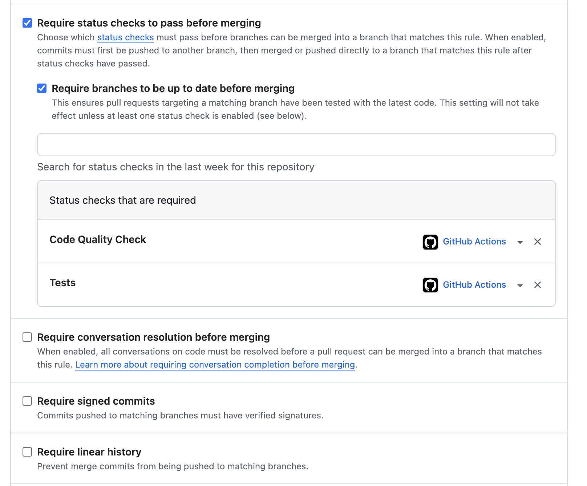
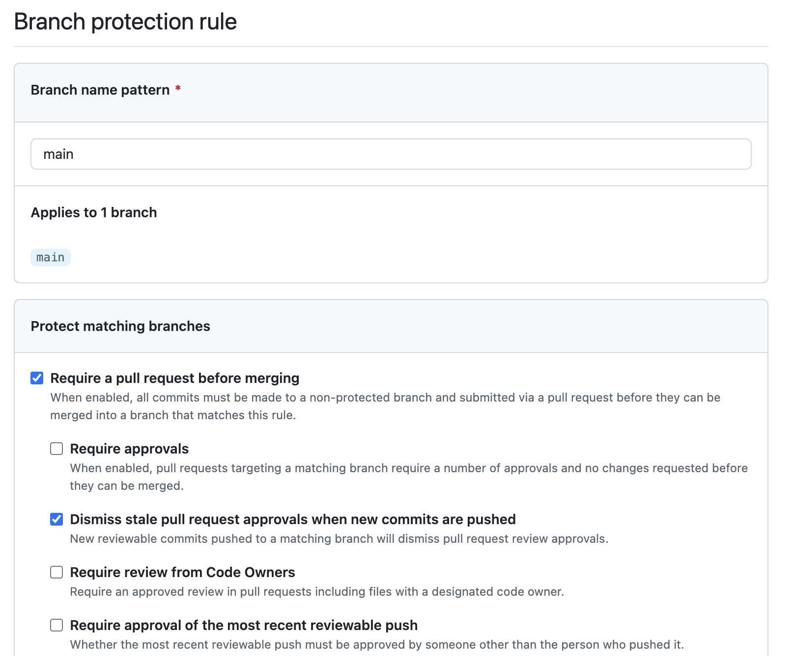

# Support API - Système de Support Client

[](https://github.com/VOTRE_USERNAME/support-api/actions/workflows/ci.yml)

## Table des matières

- [Workflow Git](#workflow-git)
- [CI/CD](#cicd)
- [Installation et utilisation](#installation-et-utilisation)
- [Structure du projet](#structure-du-projet)

## Workflow Git

### Schéma du workflow

```
main (protégée) ← Pull Request ← feature/nom-feature
     ↓
  Validation automatique (CI/CD)
     ↓
  Merge après review
```

### Règles de protection configurées




- ❌ **Pas de push direct sur main**
- ✅ **Pull Request obligatoire**
- ✅ **Status checks obligatoires** : `code-quality`, `tests`
- ✅ **Branches à jour avant merge**

### Comment créer une Pull Request

1. Créer une branche : `git checkout -b feature/nom-feature`
2. Développer avec commits conventionnels
3. Push : `git push -u origin feature/nom-feature`
4. Créer la PR sur GitHub
5. Attendre validation CI/CD ✅
6. Merger et supprimer la branche

## CI/CD

[](https://github.com/VOTRE_USERNAME/support-api/actions/workflows/ci.yml)

### Jobs configurés

#### 🔍 `code-quality`

- **ESLint** : Vérification des standards de code
- **Prettier** : Vérification du formatage
- **Rôle** : Garantir la qualité et la cohérence du code

#### 🧪 `tests`

- **Tests unitaires** : Jest + Supertest
- **Coverage** : Minimum 70%
- **Base de données** : MongoDB en service
- **Rôle** : Garantir le bon fonctionnement

### Required checks

- `code-quality` : Bloque si standards non respectés
- `tests` : Bloque si tests échouent ou coverage < 70%

## Installation et utilisation

### Prérequis

- Node.js 18+
- MongoDB 6.0+
- npm

### Installation

```bash
git clone https://github.com/VOTRE_USERNAME/support-api.git
cd support-api
npm install
```

### Commandes disponibles

```bash
npm start           # Démarrer le serveur
npm run dev         # Mode développement avec nodemon
npm test            # Lancer les tests
npm run test:coverage # Tests avec coverage
npm run seed        # Peupler la base de données
npm run lint        # Vérifier ESLint
npm run format      # Formatter avec Prettier
```

### Exemples d'appels API

#### Santé du serveur

```bash
GET /health
Response: {"status":"ok","timestamp":"2024-01-01T00:00:00.000Z"}
```

#### Lister les types de requêtes

```bash
GET /api/request-types
Response: {"success":true,"data":[...],"count":5}
```

#### Créer un type de requête

```bash
POST /api/request-types
Body: {
  "code": "BUG_REPORT",
  "name": "Bug Report",
  "description": "Signaler un bug",
  "category": "Technique",
  "estimatedResponseTime": 24
}
```

## Structure du projet

```
suppport-api/
├── .github/
│   ├── workflows/
│   │   └── ci.yml              # Pipeline CI/CD
│   └── pull_request_template.md # Template PR
├── src/
│   ├── config/
│   │   └── database.js         # Configuration MongoDB
│   ├── models/
│   │   └── RequestType.js      # Modèle Mongoose
│   ├── routes/
│   │   └── requestTypes.js     # Routes CRUD
│   └── server.js               # Serveur Express principal
├── tests/
│   ├── setup.js                # Configuration Jest
│   ├── requestType.model.test.js # Tests modèle
│   └── requestTypes.test.js    # Tests routes API
├── scripts/
│   └── seed.js                 # Script de peuplement
├── screen/                     # Captures GitHub
├── .eslintrc.js               # Configuration ESLint
├── .prettierrc                # Configuration Prettier
├── jest.config.json           # Configuration tests
└── package.json               # Dépendances et scripts
```

### Rôle de chaque dossier

- **src/** : Code source de l'application
- **tests/** : Tests unitaires et d'intégration
- **scripts/** : Scripts utilitaires
- **.github/** : Configuration GitHub Actions et templates
